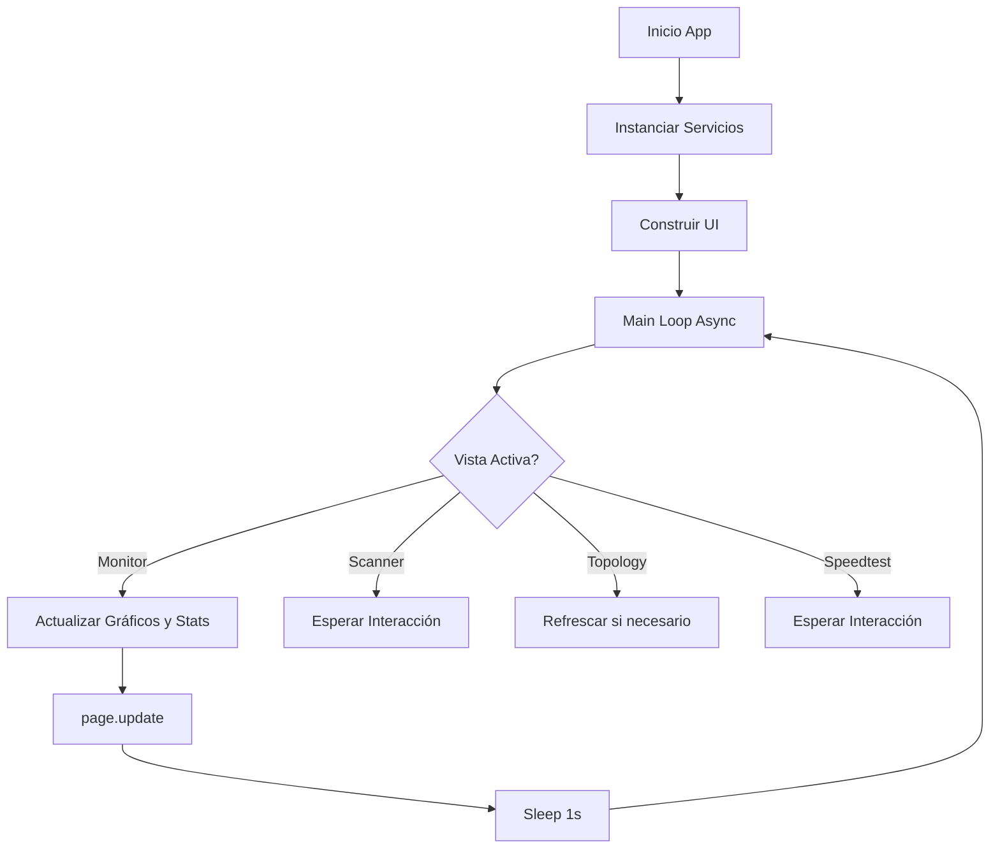

# Arquitectura del Sistema - Monitor de Red

## Visión General

El **Monitor de Red** es una aplicación de escritorio desarrollada en **Python** utilizando el framework **Flet** (basado en Flutter) para la interfaz de usuario. La aplicación sigue un patrón de arquitectura modular que separa claramente la lógica de negocio (Backend/Core) de la presentación (Frontend/UI).

La aplicación opera de manera asíncrona (`asyncio`) para garantizar que las operaciones intensivas de red (escaneos, tests de velocidad) no bloqueen la interfaz de usuario.

---

## Estructura de Directorios

El proyecto sigue una estructura limpia organizada por responsabilidad:

```
Monitor de Red/
├── core/                   # Capa de Lógica de Negocio (Backend)
│   ├── sensor.py           # Monitor de tráfico (psutil)
│   ├── scanner.py          # Escáner ARP de red (scapy)
│   ├── port_scanner.py     # Escáner de puertos TCP (socket, threads)
│   ├── speedtest_service.py # Interfaz para speedtest-cli
│   ├── device_classifier.py # Clasificación heurística (MAC/Vendor)
│   ├── data_manager.py     # Gestión y persistencia temporal de estadísticas
│   └── notifications.py    # Servicio de alertas (winotify)
├── ui/                     # Capa de Presentación (Frontend)
│   ├── views/              # Vistas principales (Monitor, Scanner, Topology, Speedtest)
│   ├── charts.py           # Componentes visuales gráficos (Matplotlib/Flet)
│   ├── sidebar.py          # Navegación lateral
│   ├── device_list.py      # Componentes de tablas reusables
│   └── layout.py           # Shell de la aplicación
├── tests/                  # Pruebas Unitarias (pytest)
├── main.py                 # Punto de entrada y orquestación
└── requirements.txt        # Dependencias
```

---

## Módulos Principales (Core)

### 1. NetworkSensor (`core/sensor.py`)
Encargado de leer las interfaces de red del sistema operativo usando `psutil`. Calcula los deltas de bytes enviados/recibidos para determinar la velocidad actual de subida y bajada.

### 2. NetworkScanner (`core/scanner.py`)
Utiliza `scapy` para enviar paquetes ARP request a la red local. Construye una lista de dispositivos activos mapeando IP a MAC y resolviendo el fabricante (Vendor) mediante la base de datos OUI (IEEE).

### 3. PortScanner (`core/port_scanner.py`)
Implementa un escáner TCP connect multi-hilo (`ThreadPoolExecutor`). Soporta tres modos:
- **Quick**: Top 20 puertos más comunes.
- **Standard**: Top 100 puertos.
- **Full**: Puertos 1-1024.

### 4. SpeedtestService (`core/speedtest_service.py`)
Wrapper alrededor de la librería `speedtest-cli`. Ejecuta pruebas de latencia, bajada y subida contra el servidor óptimo más cercano. Se ejecuta en un Thread separado para no congelar el loop de eventos de Flet.

### 5. DeviceClassifier (`core/device_classifier.py`)
Sistema de reglas heurísticas que determina el tipo de dispositivo (Router, Phone, PC, Printer) basándose en la dirección IP (Gateway) y palabras clave en el nombre del fabricante (Vendor).

---

## Arquitectura de UI (Flet)

La interfaz se construye componiendo controles (Widgets). `main.py` actúa como el controlador principal que orquesta la navegación y el ciclo de vida.

### Ciclo de Actualización (Main Loop)
El `main.py` implementa un bucle infinito asíncrono (`while True`) que actualiza la vista activa cada segundo:



### Navegación
La navegación se maneja mediante un `NavigationRail` (Sidebar) que controla la visibilidad (`visible=True/False`) de las vistas apiladas en un `Column` central. Esto preserva el estado de las vistas cuando se cambia entre ellas.

---

## Flujo de Datos

1.  **Monitoreo**: `NetworkSensor` -> `DataManager` -> `MonitorView` -> `Chart`
2.  **Alertas**: `DataManager` (detecta pico) -> `NotificationService` -> Notificación OS
3.  **Escaneo**: `ScannerView` (Click) -> `NetworkScanner` (Thread) -> `DeviceList`
4.  **Topología**: `ScannerView` (Discovery) -> `DeviceClassifier` -> `TopologyView` (Tree Render)

---

## Tecnologías Clave

-   **Backend**: Python 3.10+
-   **UI Framework**: Flet (Flutter para Python)
-   **Red**: Scapy (ARP), Socket (TCP), Ptsutil (Stats)
-   **Async**: asyncio, concurrent.futures
-   **Testing**: pytest, unittest.mock
